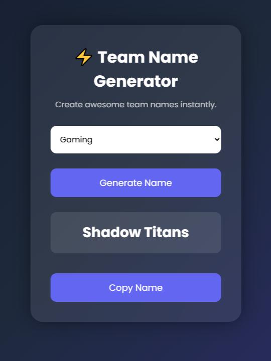

# ⚡ Team Name Generator

A simple and modern web application that generates creative team names instantly using HTML, CSS, and JavaScript.

---

## 🚀 Live Demo

https://team-name-generator-coral.vercel.app/

---

## 📸 Preview



---

## ✨ Features

- 🎯 Instant team name generation
- 🧠 Multiple categories (Gaming, Sports, Business, Fantasy, etc.)
- 📋 One-click copy to clipboard
- 🎨 Clean and modern UI
- 📱 Fully responsive design

---

## 🛠 Tech Stack

- HTML5
- CSS3
- JavaScript (Vanilla)

---

## 📂 Project Structure

```
Team-Name-Generator/
│
├── index.html
├── style.css
├── script.js
└── assets/
```

## 💡 What I Learned

- DOM manipulation in JavaScript
- Event handling
- Responsive UI design
- Working with arrays and random logic
- Structuring a frontend project properly

---

## 🔥 Future Improvements

- Dark/Light mode toggle
- Animated UI (GSAP or CSS animations)
- More advanced AI-like name generation logic
- Save favorite names feature
- Share to social media button

---
## 👨‍💻 Author

- GitHub: mfarhanahmedcode
- LinkedIn: https://www.linkedin.com/in/muhammad-farhan-ahmed-dev

---

## ⭐ If you like this project

Give it a star ⭐ and feel free to fork it!
